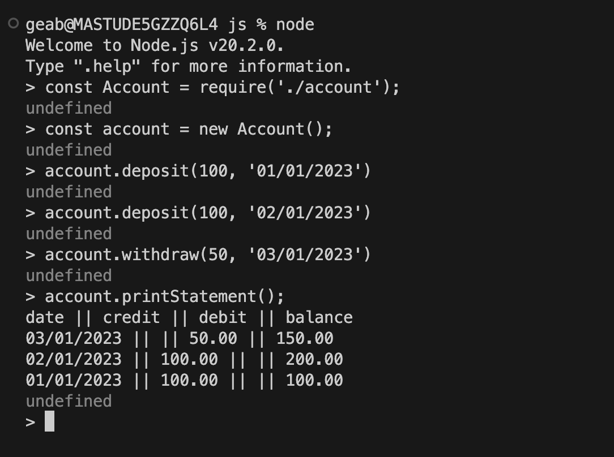

# bank_tech_test

# Statement Printing System

the project consists of an Account and a Statement class. The Account class handles the depositing and withdrawing of money, whilst the Statement class handles printing a bank account statement. The banks account statement will consist of the transaction date, amount of money withdrawn or deposited and the total balance after the transaction.

# Setup

to use the application, please follow these steps:

if you do not have node installed on your machine then please follow this link https://nodejs.org/en/download

1. clone this repository onto your computer via this link: https://github.com/georgebarrett/bank_tech_test 
2. enter ```nvm use node``` into your terminal to ensure you are using node
3. run ```npm install``` in your terminal
4. enter ```node``` into your terminal 
5. via the terminal require the class Account inside account.js: ```const Account = require('./account')```
6. create a new instance of the Account class: ```const account = new Account```
7. use the deposit, withdraw and printStatement methods to operate the application

# Example of use

```
const Account = require('./account');

const account = new Account();

account.deposit(1000, '01/01/2023');
account.deposit(2000, '02/01/2023'); 
account.withdraw(500, '03/01/2023');

account.printStatement();
```

# Classes

class Account:

this class handles the depositing and withdrawing of money

methods:

constructor()

this has an instance variable that is equal to an empty array. the transactions will be pushed into this.
it has another instance variable that sets a starting balance of zero. this will increment of decrement depending on the users actions.

deposit(amount, date)

this method is responsible for depositing amounts of money. the 'amount' argument takes an integer and represents the amount of money that is being deposited. the 'date' argument takes a string and represents the date of the transaction.

withdraw(amount, date)

this method is responsible for withdrawing amounts of money. the 'amount' argument takes an integer and represents the amount of money that is being withdrawn. the 'date' argument takes a string and represents the date of the transaction.

printStatement()

this method calls the 'print' method in the Statement class, which passes the account's transaction history as an argument.


class Statement: 

this class is responsible for generating an account statement

methods:

print()

this method prints an account statement

Example Output:
```
date || credit || debit || balance
01/01/2023 || || 100.00 || 3000.00
02/01/2023 || 5000.00 || || 8000.00
03/01/2023 || 1000.00 || || 7000.00
```
# Testing

jest is the testing framework that is used in the application

the application has 100% test coverage

to run the test suite, enter ```jest``` into the terminal. this will only work once all the packages have been installed by using ```npm install``` (referenced in Setup)

# Screenshot


